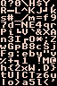

# Day 14: Tiny Runes

## Overview

Simliar to day 1, this challenge gives us 3 bin files with their output, and
then expects us to try derive the same output from the 4th bin file. Each bin
has a corresponding text file, as well as a png which is simply the text file
in image format. The bin file is a concatenation of some sort of header, a png
containing a group of letters, and a binary format with the word LiNe 
prominantly displayed when looking at the hexdump.

Ultimately it's simply a case of using the data within the binary format as an
index into the matrix of letters within the png to output the flag.

## Required Software

* python: Used to write the script to decode the message
* xxd: Displaying the hexdump of the binary files

## Solving the challenge

### Step 1 - Overview

The first step is to look at the png and txt files to see their output, then
having a look at the hexdump of each of the bin files. We can see `TiNyMeTa` is
contained within the first few bytes, before noticing the `PNG` header used for
png images after a few bytes. PNG's usually end in `IEND` (with a few extra 
bytes) however this file seems to contain more data towards the end, with the
word `LiNe` pretty noticable wihin it. This would give the assumption there are
three formats within the one file. The full hexdump of 'line1.bin' is given 
below:

```
$ xxd lines1.bin
00000000: 5469 4e79 4d65 5461 0000 0010 0000 0002  TiNyMeTa........
00000010: 0008 0008 080c 0048 0002 002a 5478 5472  .......H...*TxTr
00000020: 0000 0301 8950 4e47 0d0a 1a0a 0000 000d  .....PNG........
00000030: 4948 4452 0000 0040 0000 0060 0103 0000  IHDR...@...`....
00000040: 0097 0be6 ab00 0000 0650 4c54 4500 0000  .........PLTE...
00000050: f0d1 c563 8e08 7e00 0002 b649 4441 5478  ...c..~....IDATx
00000060: da25 5241 641c 6114 feb6 7da6 1123 62c5  .%RAd.a...}..#b.
00000070: fa0f 2b5d 6bc5 1a3d 8c88 556b b322 a71c  ..+]k..=..Uk."..
00000080: 6a45 2951 ca94 1a55 113d 5444 ac3d 8c3d  jE)Q...U.=TD.=.=
00000090: ac94 1e6a 4f23 6a34 ac68 ab6a 0e51 5511  ...jO#j4.h.j.QU.
000000a0: e918 6be5 9043 8d55 7bd8 ae3d fce6 107b  ..k..C.U{..=...{
000000b0: 5891 8e26 e99b f430 e679 effd df7b effb  X..&...0.y...{..
000000c0: 3e2a 01f5 96fb 7191 34c0 51e6 f640 709e  >*....q.4.Q..@p.
000000d0: 770a d980 0365 428a c31e 07ea 682c 3b49  w....eB.....h,;I
000000e0: 9022 1161 7357 5047 0497 d805 a803 091b  .".asWPG........
000000f0: d0a9 5a37 be1c 2c25 750a 81bc 022e f1b7  ..Z7..,%u.......
00000100: a002 0aa5 ae9f 3e16 e8bf a211 50ec 022a  ......>.....P..*
00000110: 4509 0363 6362 9d7b 6611 0588 c886 8522  E..ccb.{f......"
00000120: 6013 d69b b72f 91ce c4cf 3998 d1a8 fcb6  `..../....9.....
00000130: a9f8 ee55 48d9 0da8 f30b fa14 f58e 9ba2  ...UH...........
00000140: 5b73 dbd4 d980 0e4b 5768 7304 83d1 ef51  [s.....KWhs....Q
00000150: 1dd7 09e0 1454 6b24 fcaf ef86 a006 9019  .....Tk$........
00000160: 6438 c0fd e369 e8b7 caa4 e497 647a d50e  d8...i......dz..
00000170: 4985 b53a 9ce7 e93c eb02 53f3 5942 37de  I..:...<..S.YB7.
00000180: a89d 2529 e375 1487 aabb a8b8 99d7 8f28  ..%).u.........(
00000190: 9402 e385 bd1c e3f4 119d 9046 a9fe 1d44  ...........F...D
000001a0: e5f7 1a0d f93d 4c5f 30ce ef00 234d 3275  .....=L_0...#M2u
000001b0: e8e1 c393 3d72 c004 edec f0f4 d2b2 55f2  ....=r........U.
000001c0: 5023 6836 34cd 6d50 7527 0904 cc4f 98fa  P#h64.mPu'...O..
000001d0: 7b17 3f12 fc3c e4cc 2238 30dc 3fd0 7a3a  {.?..<.."80.?.z:
000001e0: 2130 edc0 13b3 cc8f 273c 088b 71bc 6747  !0......'<..q.gG
000001f0: 9eaa 328e 176a 9ee6 916f 5743 9422 ce4c  ..2..j...oWC.".L
00000200: 85a9 a31c eb35 7d81 508b 3a0a b590 6239  .....5}.P.:...b9
00000210: 8c16 8dba 51fa 2816 a589 6c9d ff5b 54b3  ....Q.(...l..[T.
00000220: 1c18 8ed9 a001 84c4 8d5e e55f a5b4 0993  .........^._....
00000230: d2ca 7125 846d d250 f95f 635a c440 e922  ..q%.m.P._cZ.@."
00000240: 20b4 93bd 2507 3d72 aa75 e995 3cbe b4ce   ...%.=r.u..<...
00000250: 3d3d ff80 fc87 3223 9167 9300 7d60 5ad0  ==....2#.g..}`Z.
00000260: 0373 3b03 7427 48d8 db8c 3212 5470 3331  .s;.t'H...2.Tp31
00000270: 1f03 326c 615a 02df 8949 b620 8b20 e373  ..2laZ...I. . .s
00000280: 4efa c5ad 0bc2 a4e6 01e3 4f94 46cb 07fb  N.........O.F...
00000290: 8dc2 b5fd d60b e09c b02f 4ef2 c024 f3ac  ........./N..$..
000002a0: ab23 a1f0 62e7 b32b 5da8 6bb1 7f2c a001  .#..b..+].k..,..
000002b0: d20b 6e6e d94a 0f63 4d99 e999 2155 62d3  ..nn.J.cM...!Ub.
000002c0: d606 0572 0b9c 7bf3 328c 4bec c2f0 c6a2  ...r..{.2.K.....
000002d0: 7c22 1f78 16b0 1295 c35b 3418 30cd 8c44  |".x.....[4.0..D
000002e0: 42ae 38b5 6f3f 9955 76d3 a0af c60a f64a  B.8.o?.Uv......J
000002f0: 69ee 66e6 4f3b 9da4 ee70 499d 6bc7 6603  i.f.O;...pI.k.f.
00000300: 443e ef4a 0e02 bd7b a59c 81fd e3dd 4cf9  D>.J...{......L.
00000310: 0707 9205 d0b7 2b6c e400 0000 0049 454e  ......+l.....IEN
00000320: 44ae 4260 824c 694e 6500 0000 3c05 0103  D.B`.LiNe...<...
00000330: 0a04 0806 0903 0700 0500 0a01 0b00 0502  ................
00000340: 0704 0806 0700 0403 0b07 0a05 0b05 0905  ................
00000350: 0905 0904 0802 0505 0905 0905 0904 0802  ................
00000360: 0505 0905 0905 0906 074c 694e 6500 0000  .........LiNe...
00000370: 5405 0103 0a04 0806 0903 0700 0500 0a01  T...............
00000380: 0b00 0502 0704 0806 0702 0504 0800 0a00  ................
00000390: 0901 0b07 0a01 0700 0900 0a04 0805 0701  ................
000003a0: 0b07 0a04 0800 0603 0707 0303 0704 0803  ................
000003b0: 0b04 0801 0604 0300 0404 0801 0707 0a00  ................
000003c0: 0505 0906 07                             .....
```

### Step 2 - Extracting the streams

The first thing to do would be to extract the different byte streams and take a
look at them in isolation, starting with the PNG as it's the only known format.
This is achieved with the following python snippet:

```python
def extract_data(filename):
    png_end = b'IEND\xaeB`\x82'

    with open(filename, 'rb') as f:
        header = f.read(0x24)
        data = f.read()

    offset = data.find(png_end) + len(png_end)
    png = data[:offset]
    lines = data[offset:]

    return (header, png, lines)

(h1, p1, l1) = extract_data('lines1.bin')
(h2, p2, l2) = extract_data('lines2.bin')
(h3, p3, l3) = extract_data('lines3.bin')

assert p1 == p2 == p3

with open('letters.png', 'wb') as f:
    f.write(p1)
```

It looks like all the PNG's are the same in each bin file, which makes things a
little easier. The PNG is displayed below:



So it just displays a list of letters, which makes things clearer - one of the
other two formats likely uses this as a reference when outputting text.

The headers are very similar between each of the files too, with only slight
differences. It could be the size of each file or something similar, so this
can be ignored for now while we examine the final data stream.

### Step 3 - Making sense of the data

Looking at the hexdumps of each of the "lines" sections and comparing them to
the text, it looks like the number of times the word `LiNe` appears corresponds
to the number of lines within the text. We can take this as our marker and 
compare the different texts here. 

There always seems to be three null bytes after `LiNe`, and the next byte after
that differs even though text in the txt files is similar. This next byte 
likely represents the length of the remaining line in bytes, as the bytes 
following this one are the same for similar text. This can be observed in 
lines1, where both lines start with the text "JC Denton", and the bytes after 
the initial `LiNe\0\0\0` and presumed length are `05 01 03 0A 04 08 ...`:

```
00000000: 4C 69 4E 65 00 00 00 3C  05 01 03 0A 04 08 06 09  LiNe...<........
00000010: 03 07 00 05 00 0A 01 0B  00 05 02 07 04 08 06 07  ................
00000020: 00 04 03 0B 07 0A 05 0B  05 09 05 09 05 09 04 08  ................
00000030: 02 05 05 09 05 09 05 09  04 08 02 05 05 09 05 09  ................
00000040: 05 09 06 07 4C 69 4E 65  00 00 00 54 05 01 03 0A  ....LiNe...T....
00000050: 04 08 06 09 03 07 00 05  00 0A 01 0B 00 05 02 07  ................
00000060: 04 08 06 07 02 05 04 08  00 0A 00 09 01 0B 07 0A  ................
00000070: 01 07 00 09 00 0A 04 08  05 07 01 0B 07 0A 04 08  ................
00000080: 00 06 03 07 07 03 03 07  04 08 03 0B 04 08 01 06  ................
00000090: 04 03 00 04 04 08 01 07  07 0A 00 05 05 09 06 07  ................
```

Bytes after this are all genearlly under 16 or so, and looking at the first 
letter of `lines1.txt` (J), and comparing it to the location of the letter in
the PNG, we can see it's at location 5 across, 1 down. This matches the first
two bytes after our length. From now it's just a case of writing a script to
extract a byte at at time, using each pair of values as an index into a matrix
of letters. There are some letters in the PNG that don't seem standard, however
these can be ignored until there comes a time that the output doesn't make
sense. Luckily everything worked first time, and the flag was output:

> Jock: "Oh my God! JC! A flag!"

> JC Denton: "A flag! AOTW{wh4t_4_r0tt3n_fi13_f0rm4t}"

```
AOTW{wh4t_4_r0tt3n_fi13_f0rm4t}
```

The full script is located at [solve.py](solve.py).
